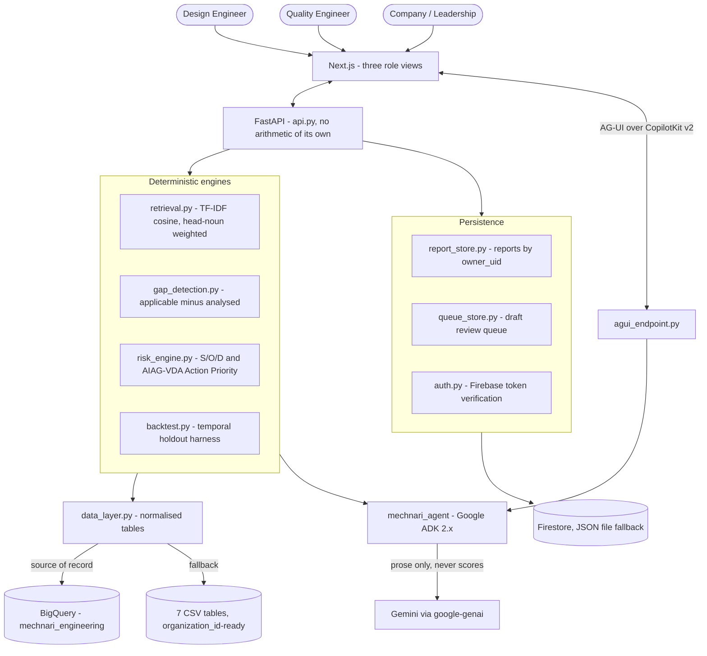

# ⚙️ Mechnari.ai — AI DFMEA Risk Copilot

[](https://www.python.org/)
[](https://google.github.io/adk-docs/)
[](https://nextjs.org/)
[](https://www.aiag.org/)
[](#-where-the-data-comes-from)
[](#-tests)
[](https://app.mechnari.in)
[](LICENSE)

**Mechnari.ai treats a manufacturer's own warranty history as the primary knowledge
source for analysing a new part — and tells engineers what the review they just
signed never checked.**

A Design FMEA is the mandatory instrument for catching how a part fails before it
is built. In practice it is filled in by a room of engineers relying on memory. If
nobody present happens to remember that a similar hose cracked in the field three
years ago, that failure mode simply does not make it onto the list.

This is not a hypothetical scale problem. A DFMEA for one 10–14 part package
assembly takes about **one calendar week** as a cross-functional workshop; a
tractor has **1,000+ parts** — on the order of **70–100 such workshops per
program**, run by different people at different times, with nothing keeping them
consistent with each other or with what the last program already learned.

> **The claim this project makes is not speed.** Speed is unverifiable, and the
> part being sped up — filling in the table — is the part engineers least want
> automated. The defensible claim is the inverse: *you have already seen this
> failure, and this DFMEA did not check for it.* That is checkable against an 8D
> number and it survives an audit.

**Live: <https://app.mechnari.in>** — three role views, signed out by default.
Sign in with Google only to keep reports against your account; nothing else is
gated. Deployed on Cloud Run (see [DEPLOY.md](DEPLOY.md)).

---

## 📊 Measured results

Every figure below is reproduced by a committed harness, not asserted. Run
`py backtest.py` or `py retrieval.py` to regenerate them.

### The backtest

The warranty history is cut at a date. The system sees only what was known before
it, and is asked what it would have flagged on the failures that came after.

| Metric | Result |
| --- | --- |
| DFMEA on file caught | **72%** of failures it could have anticipated |
| Mechnari would flag | **98%** — *+27 points*, holding across five cutoffs |
| Failures newly caught | **16**, all learned on a *different* part; 3 at severity 9+ |
| Warranty claims behind them | **228** (claim-weighted: 72% → 99%) |

Modes with no pre-cutoff record anywhere are counted **unknowable** and excluded
from both sides rather than scored as misses — 25 of 85 incidents at the reference
cutoff. Nobody could have flagged them, and including them would inflate the
headline. Mechnari does not score 100% either: some failures cross the taxonomy,
and a backtest that always scores perfectly is measuring its own construction.

### Cold start — a part that does not exist yet

Each part is hidden from the corpus entirely, and retrieval works from its written
description alone. It surfaces **73% of the failure modes that really failed on
it** (82 of 112), in a shortlist averaging 19 candidates out of 71 catalogued
modes.

### Retrieval quality, reported in full

| Leave-one-out metric | Result | Reading |
| --- | --- | --- |
| Mode recall | **76%** | The product metric — applicable modes the proposal surfaces |
| True type among neighbours | 72% | Correct type appears in the shortlist |
| Leading family correct | 66% | Family-scoped modes are the general lessons |
| Leading type exactly right | **46%** | Weak — and the reason the system proposes rather than decides |

Top-1 type prediction plateaus near 50% on a 50-part corpus spread over 17 types,
and no tuning fixes it — after holding a part out, some types have a single sibling
left. So the agent does not assert a type: it proposes modes for every kind of part
among the neighbours, states its confidence, and asks an engineer to confirm. That
choice is worth **19 points of mode recall** over winner-take-all.

### What the engines find in the current knowledge base

| Engine | Finding | Detail |
| --- | --- | --- |
| Gap detection | **127 gaps** | Across 50 parts, 15 at severity 9+, every one evidence-backed. Mean DFMEA coverage 57%. |
| Occurrence from warranty | 40 understated | Claims measured on the part itself exceed the DFMEA's own estimate |
| Action Priority | 35 → 64 High | 70 rows change priority once evidence replaces workshop opinion |
| Severity consistency | 6 rows | Same failure effect scored below the organization standard |

---

## ⚡ Architecture

**Agents read findings and write English. Deterministic engines own every number.**
No agent holds a tool that could write a score — [`test_mechnari_tools.py`](test_mechnari_tools.py)
enforces that rather than this README asserting it. The division is what keeps the
output defensible under IATF 16949.



### The service boundary

`api.py` is deliberately thin: every route calls a module that already has its own
test suite and shapes the return value as JSON. It computes nothing. The Next.js
frontend talks only to that boundary. **The frontend cannot produce a number the
engines did not produce, because it contains no arithmetic.**

The copilot reaches the browser over the **AG-UI** protocol and can act on the
interface, not only describe it — fill the intake form from a spoken part
description, run the analysis, re-analyse with a corrected part type, open a
DFMEA already on file, switch role views. Three things it must refuse, and has
no tool for on either side: setting a Severity, Occurrence or Detection score;
marking an action complete; naming who owns an action. Severity comes from the
organisation's effect registry and Occurrence is counted from warranty claims,
so editing either would turn evidence back into opinion; completion and
ownership are claims about the real world only an engineer can make. Leaving a
row out is the middle case — a judgement with audit consequences — so the agent
proposes it and the engineer approves it inline.

### Why not RPN

AIAG-VDA dropped RPN in 2019 because multiplication misranks risk: `S=9, O=2, D=2`
scores 36 while `S=4, O=3, D=4` scores 48 — which says the safety-relevant failure
matters less. **Action Priority** is a band lookup read severity-first, and a lookup
table is more auditable than a product because it cannot be argued with. RPN is
retained as a legacy column only.

> ⚠️ **The Action Priority table is provisional.** AIAG-VDA publishes three separate
> AP tables (DFMEA, PFMEA, FMEA-MSR) because Occurrence and Detection mean
> different things in each. The band structure here was checked against a primary
> source — a Jochen Pfeufer (VDA project lead) slide presenting the DFMEA table at
> SMMT AQMS, Nov 2018 — which caught a real structural error: Severity has **4**
> bands (9–10 / 5–8 / 2–4 / 1), not 5. That source is an extract of a
> pre-publication draft marked non-binding, so each cell is individually tagged
> verified, derived or unconfirmed in `risk_engine.py`, and `AP_TABLE_VERIFIED`
> stays `False` until every cell is checked against the published handbook.

### Why the taxonomy has two levels

A failure mode attaches at the level it actually generalises to. Chafing
wear-through is real for any flexible line, so it sits at **family** level; coking
inside a PTFE lumen is only real downstream of an air compressor, so it sits at
**type** level. The first build keyed everything to part type and produced a
finding telling an engineer to check a wire conduit for park-brake binding.
Inheritance has to be narrow enough to stay true.

---

## 🗄️ Where the data comes from

**BigQuery is the source of record; the CSVs are the fallback.** Set
`MECHNARI_DATA_SOURCE=bigquery` and `data_layer` reads the seven knowledge-base
tables out of the `mechnari_engineering` dataset. Unset, or on any BigQuery
failure, it reads `data/*.csv` instead.

```bash
py bq_load.py            # create the dataset and load data/*.csv into it
py bq_load.py --verify   # read it back and compare against the CSVs
```

**The tables are read whole, once per process — not queried per request.** The
engines are not SQL workloads: retrieval is TF-IDF cosine over every part
description, gap detection is a set difference, and the backtest re-runs
retrieval across several temporal cutoffs. Those are iterative in-memory
computations. Pushing them into SQL would mean rewriting the four modules the
test suites cover, and would add a query round trip to every page for a dataset
this size. So BigQuery supplies the data and `data_layer` caches it exactly as
it cached the CSV — every engine downstream is unchanged and just as fast.
`list_rows` is used rather than `SELECT *`, so a table read is a storage read
and is not billed as a query.

When a pilot company's real warranty history arrives — millions of claims
rather than hundreds — that is the point to push aggregation down, and
`bq_source.py` is the seam for it.

**The switch is verified, not assumed.** Running the engines against both
sources produces identical output on all 18 headline figures — 50 parts, 127
gaps, 15 at S≥9, 57.3% mean coverage, 71.7% → 98.3% backtest recall, 228 claims
behind the newly-caught, 73.2% cold-start recall. `bq_load.py --verify` compares
row counts and column names table by table, and `/api/health` reports
`data_source` as what actually served the tables — `bigquery`, `csv`, or `mixed`
when only some fell back — rather than what was configured. `/api/health/data`
breaks that down per table with the reason for any fallback.

> That distinction caught a real bug. With the source set to `bigquery` but the
> project not resolvable locally, every table fell back to CSV and the figures
> were still correct — because the CSVs are correct. A flag reporting the
> configured *intent* would have said "bigquery" while the CSVs did all the
> work.

Fallback is one-directional: nothing writes back to BigQuery, because the
knowledge base is loaded, not edited. Tests run on CSV, so no suite needs cloud
credentials and the figures above stay reproducible offline.

---

## 🧑‍🔧 Three role views

Drafting a DFMEA, auditing one, and reporting on program risk are different jobs
and do not want the same screen.

| Route | Role | What it does |
| --- | --- | --- |
| `/design` | Design Engineer | Describe a part that need not exist yet; get candidate rows with the 8D records behind them, and on every High row the single change in Occurrence or Detection that would actually move its Action Priority — computed against the AP table, not suggested |
| `/quality` | Quality Engineer | A review queue of submitted drafts, each linkable by URL; declined High rows show as *considered and declined* rather than missing. Quality reads the full form sheet, takes the actions and marks them done — the closure date and time are stamped into the report. The same audit suite runs against parts already on file |
| `/company` | Company & Leadership | Coverage, open safety gaps by subsystem, and the backtest curve — the evidence for the spend, not row detail |

The split is what makes the declined-row trail possible: an engineer who leaves a
High row out is recorded as having decided, not as having missed it. That is the
artefact an auditor asks for.

Output is the **AIAG-VDA form sheet** itself — 29 columns, an 8D reference on
every row, Occurrence measured from real claims rather than estimated, and the
reassessed risk each recommended action would actually achieve. Responsibility,
target date, action taken and completion are left deliberately empty: they are
commitments, and the system does not invent them.

---

## 🚀 Quickstart

### Prerequisites

- **Python 3.10+** (3.13 tested)
- **Node.js 20+** — only for the Next.js frontend
- **Gemini access via Vertex AI** — only for the copilot's prose; every
  score, gap, Action Priority and backtest figure works without it

```bash
git clone https://github.com/niharika021/Mechnari-ai.git
cd Mechnari-ai
pip install -r requirements.txt
cp .env.example .env
```

### Model access

The copilot reaches Gemini through **Vertex AI**, authenticated by your
Google Cloud identity rather than an API key:

```bash
gcloud auth application-default login
gcloud services enable aiplatform.googleapis.com --project YOUR_PROJECT_ID
```

Then set `GOOGLE_CLOUD_PROJECT` in `.env` to that project.

> **Why not an AI Studio key?** As of September 2026 the keys AI Studio
> issues — the new `AQ.` "Auth key" format that replaced `AIza` — return
> `401 ACCESS_TOKEN_TYPE_UNSUPPORTED` against the Generative Language API.
> That is a known Google-side issue with no published fix; it was
> reproduced here on the latest SDK with both `x-goog-api-key` and bearer
> auth. Vertex avoids that path entirely and is the better fit for Cloud
> Run anyway, since the service account supplies the credential and there
> is no key to leak or rotate. A legacy `AIza` key still works if you have
> one — see `.env.example` for that path.
>
> Model names do not carry over: Vertex serves versioned publisher models
> and 404s on AI Studio's floating aliases (`gemini-flash-latest`).
> Availability is regional — `gemini-3.5-flash-lite` serves from `global`
> but not from `us-central1`. This deployment runs
> **`gemini-3.7-flash`** from `global`; note that the `-lite` variant of
> 3.7 does not exist, so `gemini-3.7-flash-lite` 404s while the plain
> name resolves. Set it with `MECHNARI_MODEL`.

### Run it — Next.js frontend

Two processes. Backend first:

```bash
py -m uvicorn api:app --port 8000 --reload
```

Then the frontend, in a second terminal:

```bash
cd web && cp .env.example .env.local && npm install && npm run dev
```

Open <http://localhost:3000>.

### Regenerate the dataset

```bash
py generate_csv_data.py
```

The generator is seeded, so the figures in this README reproduce exactly.

---

## 🧪 Tests

**147 tests across 9 suites, all passing.** Each file runs standalone or under
pytest:

```bash
for f in test_*.py; do py "$f"; done
```

| Suite | Tests | Covers |
| --- | --- | --- |
| `test_api.py` | 39 | Route wiring, JSON-safety, 404-not-500, queue round trip, form-sheet assembly, and that the root agent carries the frontend-tool placeholder |
| `test_risk_engine.py` | 23 | S/O/D derivation, AP band lookup, lever finding |
| `test_retrieval.py` | 17 | Describe/similarity, type inference, proposals |
| `test_mechnari_tools.py` | 13 | ADK tool surface — including that no agent can write a score |
| `test_backtest.py` | 12 | Temporal holdout, unknowable exclusion, claim weighting |
| `test_gap_detection.py` | 12 | Type ∪ family applicability, severity consistency |
| `test_queue_store.py` | 11 | Draft queue atomicity, corruption recovery, Firestore fallback |
| `test_report_store.py` | 10 | Report ownership — missing returns None, not-yours raises |
| `test_data_source.py` | 10 | BigQuery vs CSV selection, and that an unreachable warehouse degrades to the CSVs rather than failing |

---

## 📁 Repository structure

```
Mechnari-ai/
├── taxonomy.py              # Authoring source for the data model (families, types, effects)
├── generate_csv_data.py     # Seeded generator -> the 8 CSV tables
├── data_layer.py            # Loads and joins the normalised tables (BigQuery, CSV fallback)
├── bq_source.py             # Reads the knowledge base out of BigQuery
├── bq_load.py               # Loads data/*.csv into BigQuery, and verifies it
├── gap_detection.py         # Applicable modes minus analysed modes
├── risk_engine.py           # S/O/D, AIAG-VDA Action Priority, AP levers
├── retrieval.py             # TF-IDF retrieval, type inference, DFMEA proposal
├── backtest.py              # Temporal holdout + cold-start harnesses
├── queue_store.py           # Draft review queue (Firestore, JSON file fallback)
├── report_store.py          # Generated reports, owned by verified account
├── dfmea_sheet.py           # AIAG-VDA form-sheet assembly
├── auth.py                  # Firebase token verification; signed out is valid
├── agui_endpoint.py         # AG-UI endpoint over the same root agent
├── mechnari_agent/agent.py  # Google ADK 2.x root agent, sub_agents, Workflow
├── mechnari_tools.py        # Plain-function tools handed to the agents
├── api.py                   # FastAPI wrapper - thin, computes nothing
├── web/                     # Next.js frontend (three role views, CopilotKit v2)
├── DEPLOY.md                # Cloud Run deployment, and the traps in it
├── test_*.py                # 9 suites, 147 tests
├── docs/                    # Full documentation - start at docs/README.md
├── docs/build-dossier.html  # Concept and build report
├── intro.md                 # Plain-language introduction
├── schema.sql               # BigQuery DDL, generated from the CSVs
└── data/                    # 8 normalised CSV tables
```

---

## 📉 Known limitations

Stated here rather than discovered in review.

- **The data is synthetic.** Domain-correlated and internally consistent — a
  bracket only ever draws bracket-type failure modes, never a hose's — but the
  backtest measures the system against generated warranty history. The harness runs
  unchanged against a pilot company's anonymised data; that substitution is the
  next real validation, not a rewrite.
- **The AP table is provisional.** See the callout above.
- **TF-IDF is a floor, not a ceiling.** At 50 parts it is the honest choice. Moving
  to Vertex AI embeddings replaces two functions and nothing downstream.
- **Effects are inherited with their origin.** A mode carried to a new part keeps
  the effect it had on the part that taught it, so a coolant drain valve can
  inherit an AC valve's cab-climate effect. Re-evaluating effect per target part is
  the known fix.
- **Reports made signed out stay in that browser.** They are held in
  `localStorage` and tagged *this browser* in the list. Signing in keeps new
  reports with the account; it does not retroactively adopt the old ones, because
  claiming them would mean guessing that whoever is holding the browser is
  whoever just authenticated.
- **Saving a report against an account has not been exercised end to end.**
  Google sign-in is confirmed working against the live domain, and the ownership
  rules are covered by `test_report_store.py`, but no report has yet been written
  to Firestore under a real `owner_uid`. Treat that path as untested rather than
  as working.

## 🗺️ Roadmap

1. Verify the Action Priority cells against the AIAG-VDA handbook and lift the provisional label
2. Replace synthetic data with a pilot company's anonymised warranty set; re-run the backtest unchanged
3. Push aggregation down into BigQuery once the data is large enough to earn it
4. Close the loop: when a new claim arrives, flag which shipped DFMEAs predicted low risk for that mode
5. Migrate reports made while signed out into an account on first sign-in

Shipped since the first cut: the AIAG-VDA form sheet as the actual output, the
human-in-the-loop review between findings and report, the Quality action-closure
handoff, Firestore persistence, optional Google sign-in, BigQuery as the source
of record, and a copilot that acts on the interface rather than describing it.

---

## 📄 License

MIT — see [LICENSE](LICENSE).

## 🤝 Contact

Built by **Niharika Yadav** — 10+ years mechanical design engineering, agriculture
(tractors) — [@niharika021](https://github.com/niharika021)

Google Patchamomma 2026 · [Mechnari-ai](https://github.com/niharika021/Mechnari-ai)
