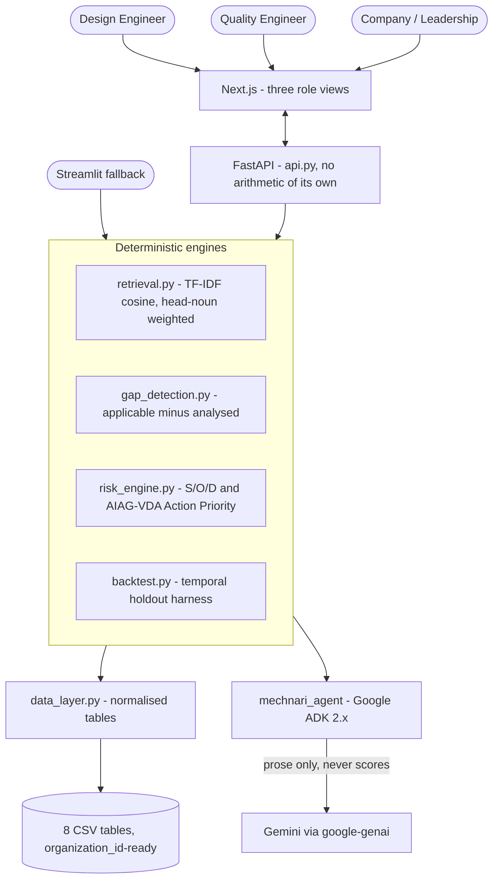

# ⚙️ Mechnari.ai — AI DFMEA Risk Copilot

[](https://www.python.org/)
[](https://google.github.io/adk-docs/)
[](https://nextjs.org/)
[](https://www.aiag.org/)
[](#-tests)
[](LICENSE)

**Mechnari.ai treats a manufacturer's own warranty history as the primary knowledge
source for analysing a new part — and tells engineers what the review they just
signed never checked.**

A Design FMEA is the mandatory instrument for catching how a part fails before it
is built. In practice it is filled in by a room of engineers relying on memory. If
nobody present happens to remember that a similar hose cracked in the field three
years ago, that failure mode simply does not make it onto the list.

This is not a hypothetical scale problem. A DFMEA for one 10–14 part package
assembly takes about **one calendar week** as a cross-functional workshop; a
tractor has **1,000+ parts** — on the order of **70–100 such workshops per
program**, run by different people at different times, with nothing keeping them
consistent with each other or with what the last program already learned.

> **The claim this project makes is not speed.** Speed is unverifiable, and the
> part being sped up — filling in the table — is the part engineers least want
> automated. The defensible claim is the inverse: *you have already seen this
> failure, and this DFMEA did not check for it.* That is checkable against an 8D
> number and it survives an audit.

---

## 📊 Measured results

Every figure below is reproduced by a committed harness, not asserted. Run
`py backtest.py` or `py retrieval.py` to regenerate them.

### The backtest

The warranty history is cut at a date. The system sees only what was known before
it, and is asked what it would have flagged on the failures that came after.

| Metric | Result |
| --- | --- |
| DFMEA on file caught | **72%** of failures it could have anticipated |
| Mechnari would flag | **98%** — *+27 points*, holding across five cutoffs |
| Failures newly caught | **16**, all learned on a *different* part; 3 at severity 9+ |
| Warranty claims behind them | **228** (claim-weighted: 72% → 99%) |

Modes with no pre-cutoff record anywhere are counted **unknowable** and excluded
from both sides rather than scored as misses — 25 of 85 incidents at the reference
cutoff. Nobody could have flagged them, and including them would inflate the
headline. Mechnari does not score 100% either: some failures cross the taxonomy,
and a backtest that always scores perfectly is measuring its own construction.

### Cold start — a part that does not exist yet

Each part is hidden from the corpus entirely, and retrieval works from its written
description alone. It surfaces **73% of the failure modes that really failed on
it** (82 of 112), in a shortlist averaging 19 candidates out of 71 catalogued
modes.

### Retrieval quality, reported in full

| Leave-one-out metric | Result | Reading |
| --- | --- | --- |
| Mode recall | **76%** | The product metric — applicable modes the proposal surfaces |
| True type among neighbours | 72% | Correct type appears in the shortlist |
| Leading family correct | 66% | Family-scoped modes are the general lessons |
| Leading type exactly right | **46%** | Weak — and the reason the system proposes rather than decides |

Top-1 type prediction plateaus near 50% on a 50-part corpus spread over 17 types,
and no tuning fixes it — after holding a part out, some types have a single sibling
left. So the agent does not assert a type: it proposes modes for every kind of part
among the neighbours, states its confidence, and asks an engineer to confirm. That
choice is worth **19 points of mode recall** over winner-take-all.

### What the engines find in the current knowledge base

| Engine | Finding | Detail |
| --- | --- | --- |
| Gap detection | **127 gaps** | Across 50 parts, 15 at severity 9+, every one evidence-backed. Mean DFMEA coverage 57%. |
| Occurrence from warranty | 40 understated | Claims measured on the part itself exceed the DFMEA's own estimate |
| Action Priority | 35 → 64 High | 70 rows change priority once evidence replaces workshop opinion |
| Severity consistency | 6 rows | Same failure effect scored below the organization standard |

---

## ⚡ Architecture

**Agents read findings and write English. Deterministic engines own every number.**
No agent holds a tool that could write a score — [`test_mechnari_tools.py`](test_mechnari_tools.py)
enforces that rather than this README asserting it. The division is what keeps the
output defensible under IATF 16949.



### The service boundary

`api.py` is deliberately thin: every route calls a module that already has its own
test suite and shapes the return value as JSON. It computes nothing. The Next.js
frontend talks only to that boundary; Streamlit keeps calling the same modules
in-process, unchanged. **Neither frontend can produce a number the engines did not
produce, because neither frontend contains the arithmetic.**

### Why not RPN

AIAG-VDA dropped RPN in 2019 because multiplication misranks risk: `S=9, O=2, D=2`
scores 36 while `S=4, O=3, D=4` scores 48 — which says the safety-relevant failure
matters less. **Action Priority** is a band lookup read severity-first, and a lookup
table is more auditable than a product because it cannot be argued with. RPN is
retained as a legacy column only.

> ⚠️ **The Action Priority table is provisional.** AIAG-VDA publishes three separate
> AP tables (DFMEA, PFMEA, FMEA-MSR) because Occurrence and Detection mean
> different things in each. The band structure here was checked against a primary
> source — a Jochen Pfeufer (VDA project lead) slide presenting the DFMEA table at
> SMMT AQMS, Nov 2018 — which caught a real structural error: Severity has **4**
> bands (9–10 / 5–8 / 2–4 / 1), not 5. That source is an extract of a
> pre-publication draft marked non-binding, so each cell is individually tagged
> verified, derived or unconfirmed in `risk_engine.py`, and `AP_TABLE_VERIFIED`
> stays `False` until every cell is checked against the published handbook.

### Why the taxonomy has two levels

A failure mode attaches at the level it actually generalises to. Chafing
wear-through is real for any flexible line, so it sits at **family** level; coking
inside a PTFE lumen is only real downstream of an air compressor, so it sits at
**type** level. The first build keyed everything to part type and produced a
finding telling an engineer to check a wire conduit for park-brake binding.
Inheritance has to be narrow enough to stay true.

---

## 🧑‍🔧 Three role views

Drafting a DFMEA, auditing one, and reporting on program risk are different jobs
and do not want the same screen.

| Route | Role | What it does |
| --- | --- | --- |
| `/design` | Design Engineer | Describe a part that need not exist yet; get candidate rows with the 8D records behind them, and on every High row the single change in Occurrence or Detection that would actually move its Action Priority — computed against the AP table, not suggested |
| `/quality` | Quality Engineer | A review queue of submitted drafts, each linkable by URL; declined High rows show as *considered and declined* rather than missing. The same audit suite runs against parts already on file |
| `/company` | Company & Leadership | Coverage, open safety gaps by subsystem, and the backtest curve — the evidence for the spend, not row detail |

The split is what makes the declined-row trail possible: an engineer who leaves a
High row out is recorded as having decided, not as having missed it. That is the
artefact an auditor asks for.

---

## 🚀 Quickstart

### Prerequisites

- **Python 3.10+** (3.13 tested)
- **Node.js 20+** — only for the Next.js frontend
- **Google AI Studio API key** — only for the copilot's prose; every number works without it

```bash
git clone https://github.com/niharika021/Mechnari-ai.git
cd Mechnari-ai
pip install -r requirements.txt
```

Create a `.env` in the repository root:

```env
GEMINI_API_KEY=your_google_ai_studio_api_key_here
GOOGLE_API_KEY=your_google_ai_studio_api_key_here
```

### Run it — Next.js frontend

Two processes. Backend first:

```bash
py -m uvicorn api:app --port 8000 --reload
```

Then the frontend, in a second terminal:

```bash
cd web && cp .env.example .env.local && npm install && npm run dev
```

Open <http://localhost:3000>.

### Run it — Streamlit fallback

The same engines, one process, no Node required:

```bash
streamlit run app.py
```

Open <http://localhost:8501>.

### Regenerate the dataset

```bash
py generate_csv_data.py
```

The generator is seeded, so the figures in this README reproduce exactly.

---

## 🧪 Tests

**103 tests across 7 suites, all passing.** Each file runs standalone or under
pytest:

```bash
for f in test_*.py; do py "$f"; done
```

| Suite | Tests | Covers |
| --- | --- | --- |
| `test_risk_engine.py` | 23 | S/O/D derivation, AP band lookup, lever finding |
| `test_api.py` | 17 | Route wiring, JSON-safety, 404-not-500, queue round trip |
| `test_retrieval.py` | 17 | Describe/similarity, type inference, proposals |
| `test_mechnari_tools.py` | 13 | ADK tool surface — including that no agent can write a score |
| `test_backtest.py` | 12 | Temporal holdout, unknowable exclusion, claim weighting |
| `test_gap_detection.py` | 12 | Type ∪ family applicability, severity consistency |
| `test_queue_store.py` | 9 | Draft queue atomicity and corruption recovery |

---

## 📁 Repository structure

```
Mechnari-ai/
├── taxonomy.py              # Authoring source for the data model (families, types, effects)
├── generate_csv_data.py     # Seeded generator -> the 8 CSV tables
├── data_layer.py            # Loads and joins the normalised tables
├── gap_detection.py         # Applicable modes minus analysed modes
├── risk_engine.py           # S/O/D, AIAG-VDA Action Priority, AP levers
├── retrieval.py             # TF-IDF retrieval, type inference, DFMEA proposal
├── backtest.py              # Temporal holdout + cold-start harnesses
├── queue_store.py           # Draft review queue (JSON, atomic writes)
├── mechnari_agent/agent.py  # Google ADK 2.x root agent, sub_agents, Workflow
├── mechnari_tools.py        # Plain-function tools handed to the agents
├── api.py                   # FastAPI wrapper - thin, computes nothing
├── app.py                   # Streamlit fallback UI
├── web/                     # Next.js frontend (three role views)
├── test_*.py                # 7 suites, 103 tests
├── docs/build-dossier.html  # Concept and build report
├── intro.md                 # Plain-language introduction
├── schema.sql               # BigQuery DDL
└── data/                    # 8 normalised CSV tables
```

---

## 📉 Known limitations

Stated here rather than discovered in review.

- **The data is synthetic.** Domain-correlated and internally consistent — a
  bracket only ever draws bracket-type failure modes, never a hose's — but the
  backtest measures the system against generated warranty history. The harness runs
  unchanged against a pilot company's anonymised data; that substitution is the
  next real validation, not a rewrite.
- **The AP table is provisional.** See the callout above.
- **TF-IDF is a floor, not a ceiling.** At 50 parts it is the honest choice. Moving
  to Vertex AI embeddings replaces two functions and nothing downstream.
- **Effects are inherited with their origin.** A mode carried to a new part keeps
  the effect it had on the part that taught it, so a coolant drain valve can
  inherit an AC valve's cab-climate effect. Re-evaluating effect per target part is
  the known fix.

## 🗺️ Roadmap

1. Verify the Action Priority cells against the AIAG-VDA handbook and lift the provisional label
2. Export to the AIAG-VDA form sheet, so output lands in the format engineers already use
3. Replace synthetic data with a pilot company's anonymised warranty set; re-run the backtest unchanged
4. Migrate the CSV layer to Postgres with real multi-tenant auth
5. Close the loop: when a new claim arrives, flag which shipped DFMEAs predicted low risk for that mode

---

## 📄 License

MIT — see [LICENSE](LICENSE).

## 🤝 Contact

Built by **Niharika Yadav** — 10+ years mechanical design engineering, agriculture
(tractors) — [@niharika021](https://github.com/niharika021)

Google Patchamomma 2026 · [Mechnari-ai](https://github.com/niharika021/Mechnari-ai)
