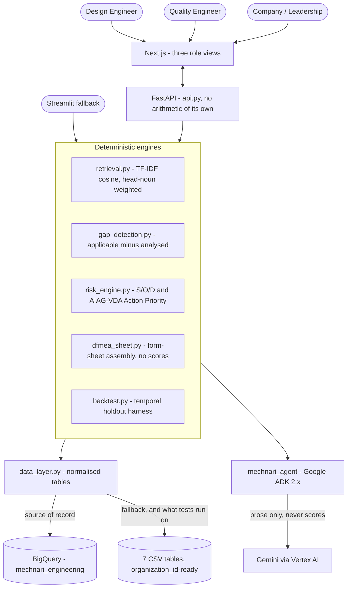

# Architecture

## The shape of it



## Layers

| Layer | Files | Rule it obeys |
| --- | --- | --- |
| **Data** | `data_layer.py`, `bq_source.py`, `bq_load.py`, `data/*.csv`, `schema.sql` | BigQuery is the source of record; CSV is the fallback. Normalised tables, loaded and joined in one place. `organization_id`-ready for multi-tenancy. |
| **Engines** | `retrieval.py`, `gap_detection.py`, `risk_engine.py`, `dfmea_sheet.py`, `backtest.py` | Every number in the product originates here. No model calls, no network. |
| **Stores** | `queue_store.py`, `report_store.py` | Runtime state — the review queue and saved reports. Firestore when available, JSON file otherwise. |
| **Service** | `api.py`, `auth.py`, `agui_endpoint.py` | Thin. Calls a tested module, shapes JSON. Computes nothing. |
| **Agent** | `mechnari_agent/agent.py`, `mechnari_tools.py` | Reads findings, writes English, drives the UI. Holds no tool that writes a score. |
| **Frontend** | `web/` (Next.js), `app.py` (Streamlit) | Renders. Contains no arithmetic, so it cannot produce a number the engines did not. |

## The service boundary

`api.py` is deliberately thin: every route calls a module that already has
its own test suite and shapes the return value as JSON.

Two consequences worth stating:

- **Neither frontend can produce a number the engines did not produce**,
  because neither frontend contains the arithmetic. When an engineer edits
  Detection on a review row, the new Action Priority comes back from
  `POST /api/rescore` — a frontend that did its own band lookup would be a
  second, unversioned copy of the AP table.
- **Streamlit is not a second implementation.** `app.py` calls the same
  modules in-process. It exists so the whole product runs in one Python
  process with no Node required.

### CORS

Origins are `http://localhost:3000`, `http://127.0.0.1:3000`, plus whatever
`ALLOWED_ORIGINS` lists (comma-separated) — never `*`. This API can trigger a
knowledge-base reload and read the draft queue, neither of which should be
reachable cross-origin from an untrusted page.

### Error contract

- `503` — the dataset is missing or unreadable (`data_layer.DatasetError`).
- `404` — unknown `part_id`, `draft_id` or `report_id`. Never a 500.
- `400` — a malformed request: an empty description, an unknown
  `part_type_id`, more than 25 parts in one sheet request, more than 500 rows
  in one rescore.
- `403` — a report that belongs to somebody else, on write. On *read* an
  unowned report is `404` on purpose: a stranger should not learn that an id
  exists.

## The agent layer

Built to the Google ADK 2.x Python conventions:

- the package exposes a module-level `root_agent`, which is what
  `adk run mechnari_agent` and `adk web` look for;
- tools are plain typed Python functions, which ADK wraps as FunctionTools;
- specialists are composed under a coordinator via `sub_agents`;
- the fixed review pipeline is a graph `Workflow` — the ADK 2.x replacement
  for the older SequentialAgent template.

```
root_agent  mechnari_dfmea_copilot        tools: KNOWLEDGE_BASE_TOOLS
  ├── gap_analyst                         tools: GAP_TOOLS
  ├── risk_scorer                         tools: RISK_TOOLS
  └── mitigation_writer                   tools: (none — it only writes)

dfmea_review_workflow                     the fixed review pipeline, as a graph
```

The tool surface (`mechnari_tools.py`) is entirely read-only:

`list_parts` · `get_part_profile` · `find_unanalysed_failure_modes` ·
`get_risk_scores` · `get_occurrence_evidence` · `check_severity_consistency` ·
`analyse_new_part`

There is no `set_severity`, no `mark_complete`, no `assign_owner`. That is
the enforcement: **an action the agent has no tool for is an action it cannot
take, whatever it is asked.** `test_mechnari_tools.py` asserts it, so the
guarantee survives a refactor rather than living in a comment.

The agent is also told, in its instructions, that the tools are the only
source of numbers: never calculate, estimate, adjust or round a score; never
present a figure that did not come back from a tool call; if a tool returns
`status: error`, say what failed and stop rather than filling the gap with a
plausible number; always quote the record identifiers a finding rests on.

### Two ways to reach the same agent

| Route | Transport | Why it exists |
| --- | --- | --- |
| `POST /api/copilot/ask` | Synchronous JSON | Dependency-light, test-covered, works without an SSE client. The fallback. |
| `POST /api/ag-ui` | [AG-UI](https://docs.ag-ui.com) over SSE | Streams token by token, and carries the browser's client-side tools to the agent. |

`agui_endpoint.py` mounts the second one over the *same* `root_agent`. It adds
a transport, not a second agent.

One load-bearing detail: `ag-ui-adk` walks the agent tree looking for an
`AGUIToolset` placeholder and swaps in a per-run proxy built from the tools
the browser declared. An agent without that placeholder never learns the
frontend tools exist — every "switch to the company view" turned back into
prose describing how to click.

### The CopilotKit runtime

`web/src/app/api/copilotkit/[[...path]]/route.ts` is a relay. That Next.js
process calls no model: it forwards the browser to the AG-UI endpoint, and
the ADK agent behind it does the model work.

The catch-all path segment is required — the CopilotKit v2 handler is
multi-route (`POST /agent/:agentId/run`, `GET /info` and siblings beneath the
base path), so a single `route.ts` at `/api/copilotkit` would answer the base
path and 404 everything under it.

## Model access

The copilot reaches Gemini through **Vertex AI**, authenticated by the
caller's Google Cloud identity — Application Default Credentials locally, the
service account on Cloud Run. There is no API key to leak or rotate.

This is not only a preference. As of September 2026 the keys AI Studio issues
(the `AQ.` format that replaced `AIza`) return
`401 ACCESS_TOKEN_TYPE_UNSUPPORTED` against the Generative Language API — a
known Google-side issue with no published fix, reproduced here on the latest
SDK with both `x-goog-api-key` and bearer auth. A legacy `AIza` key still
works if you have one.

Model names do **not** carry over between the two paths: Vertex serves
versioned publisher models and 404s on AI Studio's floating aliases
(`gemini-flash-latest`). Availability is regional — `gemini-3.5-flash-lite`
serves from `global` but not from `us-central1`.

## Knowledge base source

BigQuery when `MECHNARI_DATA_SOURCE=bigquery` and a project resolves;
`data/*.csv` otherwise, and on any BigQuery failure. `data_layer._read` is the
only function that ever touches a file or a table, so the swap is a change
inside that one module — every engine downstream is unchanged and reads the
same DataFrame shape either way.

Tables are read whole, once per process (`list_rows`, not `SELECT *`, so a
read is a storage read and is not billed as a query), not queried per
request. The engines are not SQL workloads — retrieval is TF-IDF cosine,
gap detection is a set difference, the backtest re-runs retrieval across
several cutoffs — so BigQuery supplies the data and `data_layer` caches it
exactly as it cached the CSV.

`GET /api/health` reports `data_source` as **what actually served the
tables** (`bigquery` / `csv` / `mixed`), not what was configured. That
distinction caught a real bug: a freshly started process answered
`bigquery` before it had read a single table, which is the reassuring-but-
unearned answer this field exists to prevent — it now reads one small
table before answering. `GET /api/health/data` breaks the same thing down
per table, with the reason for any fallback.

Fallback is one-directional. Nothing writes back to BigQuery, because the
knowledge base is loaded, not edited. Tests run on CSV, so no suite needs
cloud credentials.

## Storage

| What | Firestore collection | File fallback |
| --- | --- | --- |
| Review queue | `draft_queue` | `.mechnari_runtime/draft_queue.json` |
| Saved reports | `reports` | `.mechnari_runtime/reports.json` |

Both stores prefer Firestore and degrade to an atomic JSON file when it is
unreachable. `GET /api/health` reports which backend is live, because a
deployment that quietly fell back to the file store is the precise failure
this is meant to prevent: on Cloud Run that file is per-instance and resets
on scale-to-zero, so the queue would look fine until it emptied itself.

## Authentication

Google sign-in, verified server-side against Google's signing keys by
`firebase_admin`. **Sign-in is optional by design.**

Every read view — the drafted DFMEA, the review queue, the program rollup,
the copilot — works signed out, because the people who most need the rollup
(leadership, an auditor, someone evaluating the tool) are the least likely to
have an account provisioned. A login wall in front of an unfamiliar tool
loses the reader before the tool gets a chance to be judged.

What signing in buys is **ownership**: a report gains an author, and "my
reports" starts meaning something across machines instead of being whatever
happens to be in this browser.

So `auth.current_user` returns `None` rather than raising when there is no
token, and each route decides for itself whether it needs one
(`auth.require_user` for the ones that do). An unverifiable token is treated
as no token at all rather than as an error — a stale token in an open tab
should degrade to signed-out, not break the page.
