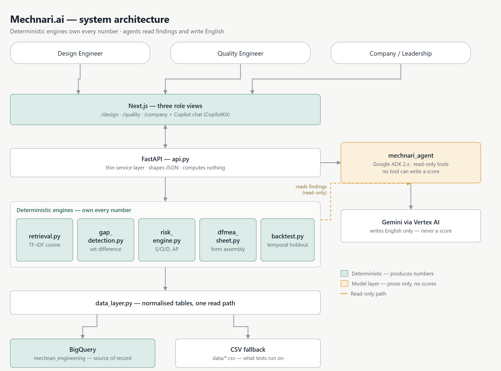

# Mechnari.ai: Teaching a Design FMEA to Remember What the Company Already Learned

### Description

Mechnari.ai reads a manufacturer's own warranty and 8D failure history and cross-checks it against the Design FMEA (DFMEA) an engineer just filed — flagging exactly which known failure modes the document never checked for, with the field record attached as proof. Deterministic engines own every score; an AI agent only reads findings and explains them in English.

---

### Use case — the problem statement

A DFMEA is the mandatory document for catching how a part can fail before it's built. For every failure mode, it records the effect, how bad it is (Severity), how likely it is (Occurrence), whether design verification would catch it (Detection), and what the team will do about it. It's an audited artifact — IATF 16949 expects one, and an auditor expects it to be defensible.

The problem is *how* it gets filled in: a room of engineers, working from memory, for about a week per 10–14 part assembly. A tractor has 1,000+ parts. That's on the order of 70–100 of these workshops per program, run by different people at different times, with nothing keeping them consistent with each other or with what the last program already learned. If nobody in the room happens to remember that a similar hose cracked in the field three years ago, that failure mode doesn't make the list — not because anyone was careless, but because a workshop's memory is exactly as good as the people sitting in it that week.

The company already has the answer sitting in its warranty system. Every claim, every 8D report, every field failure is a recorded instance of "this failed, and here's why." That record is almost never in the room.

### How I'm solving it

Mechnari.ai's core move is to treat the warranty archive as the knowledge base a DFMEA workshop is missing, and to keep the two roles — "what happened" and "what score does that imply" — completely separate:

1. **Retrieval finds the cousins.** A part is described in plain language (name, function, material — no part number required). TF-IDF cosine similarity, weighted toward the compound noun's head word (a *Fuel Return Line Clamp* is a clamp, not a line), finds the most similar parts already in the bill of materials.
2. **A two-level taxonomy pulls the right failure modes.** Every part belongs to a *type*; every type belongs to a *family*. A failure mode attaches at whichever level it actually generalizes to — chafing wear-through is real for any flexible line (family-level), coking inside a PTFE lumen is only real downstream of an air compressor (type-level). Get this wrong and you get a system telling an engineer to check a wire conduit for park-brake binding — an early, real failure of the first version.
3. **Scoring never asks anyone's opinion.** Severity comes from a registry keyed to the failure *effect*, so the same effect carries the same severity on every program. Occurrence is counted directly from claims-per-1000-units-in-service, mapped onto the standard AIAG occurrence anchors. Action Priority — the 2019 replacement for the old RPN multiplication, which can rank a safety-critical failure below a nuisance one — is a lookup table read severity-first, occurrence-second, detection-third.
4. **Gap detection is a set subtraction, not a generation task.** `applicable_modes(part) − analysed_modes(part)`. Every finding either exists in the knowledge base or it doesn't — nothing is invented, and every gap carries the actual 8D record number it's backed by.
5. **An AI agent explains; it never scores.** A Google ADK agent sits on top of all of this with a strictly read-only tool surface — it can look up findings, fill in a form, or switch a view, but there is no tool it can call that writes a Severity, Occurrence, or Detection value, marks an action complete, or names an owner. That guarantee is enforced by a test that asserts no such tool exists, so it can't quietly reappear in a refactor.

The result is validated, not asserted: a temporal backtest — train on warranty records before a cutoff date, test on what happened after — shows the manual DFMEA baseline catching **71.7%** of failures it could have anticipated, versus **98.3%** for the system, across five different cutoff dates. Every one of the 16 newly caught failure modes at the reference cutoff was learned from a *different* part than the one it's flagging, which is the actual claim: this is transfer of institutional memory, not the system recognizing a part's own history.

### Architecture diagram

Two things the diagram is trying to make legible:

- **Nothing above the engine layer can compute a number.** The Next.js frontend and the thin FastAPI service layer only call into `retrieval.py`, `gap_detection.py`, `risk_engine.py`, `dfmea_sheet.py`, and `backtest.py` — the only five files where a Severity, Occurrence, Detection, or Action Priority value is ever produced.
- **The model layer is a dead end for numbers.** The agent's tools are read-only, and Gemini (reached via Vertex AI, never a leakable API key) only ever turns an existing finding into a sentence. There's no path from "the model said so" to a number on the form.

### Implementation steps

1. **Model the domain as data, not code.** Built eight normalized tables — part types and families, a failure-effect severity registry, the BOM, material master, a cross-program failure-mode catalog, field/warranty issues, and the DFMEA-on-file. Authored the taxonomy once and generated a seeded synthetic dataset from it, so every figure in the documentation reproduces exactly.
2. **Get retrieval honest before making it clever.** Excluded the part-type label and the system-package grouping from the text corpus the retrieval model sees, so type inference can't read the answer off its own feature vector. Measured, rather than assumed, that dropping system package moved type accuracy from 26% to 34%, and that weighting only the head noun of a compound name (instead of every word in it) was worth 4 points of mode recall.
3. **Score deterministically, and make the table auditable.** Implemented Severity as a registry lookup, Occurrence as a measured-rate-to-anchor mapping, and Action Priority as a hand-verified lookup table — checked cell by cell against a primary AIAG-VDA source rather than trusted from a secondary summary, and tagged per-cell as `VERIFIED`, `DERIVED`, or `unconfirmed` so the provisional cells are visible rather than hidden.
4. **Detect gaps as a set operation.** `applicable_modes(part) − analysed_modes(part)`, where applicable modes span both the part's type and its family. Every gap carries the field record identifier it's backed by, so a finding is checkable, not just assertable.
5. **Keep the API arithmetic-free.** Every FastAPI route calls a pre-tested module and shapes its return value as JSON. No route computes anything, which means the frontend cannot diverge from the engines' numbers — when an engineer edits Detection on a review row, the new Action Priority comes back from the API rather than from a second, unversioned copy of the lookup table in TypeScript.
6. **Wrap a read-only agent around the engines, and enforce it with a test.** Built the ADK agent's tool surface (`list_parts`, `get_risk_scores`, `find_unanalysed_failure_modes`, and similarly read-only functions) with deliberately no `set_severity`, `mark_complete`, or `assign_owner` — and wrote a test that asserts no such tool exists, so the guarantee survives refactors instead of living in a comment.
7. **Give each role its own view, over one set of engines.** A Next.js app with three role-specific views — design, quality, leadership — plus a CopilotKit chat wired to the ADK agent over the AG-UI protocol, so a fix to an engine reaches every view at once rather than being ported between them.
8. **Validate with a temporal backtest before claiming anything.** Cut the warranty history at five different dates, trained only on what came before each cutoff, and scored recall on what came after — excluding failure modes with no pre-cutoff record anywhere from both sides, since scoring those as a miss for the manual baseline would inflate the headline for free.

---

*Mechnari.ai is built against agricultural machinery data today, but nothing in the model is crop-specific — the same shape (recurring part kinds, a real DFMEA obligation, years of warranty history) applies to automotive, off-highway, and industrial equipment.*
